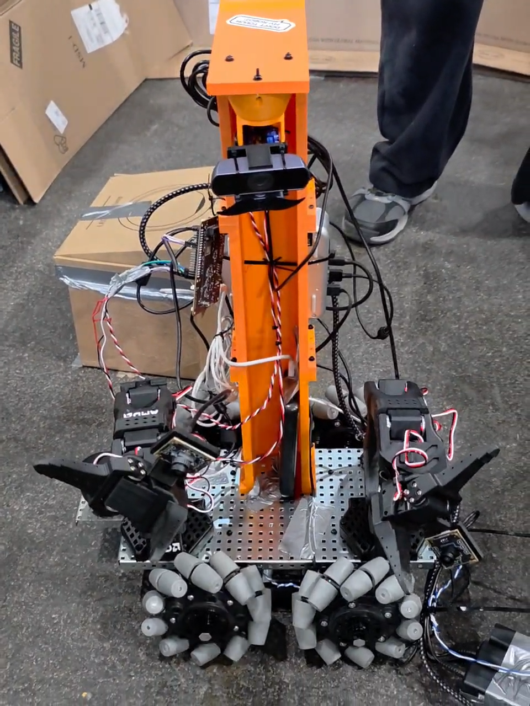

# GUARD.IAM

<p align="center">
  
  
  
  
  
  
  
</p>

<p align="center">
  <b>🥈 2nd Place — Microsoft Track &nbsp;·&nbsp; 🥉 3rd Place — AMD Track</b><br>
  <i>StarkHacks 2026 · World's Largest Hardware Hackathon · 750+ participants · 36 hours</i>
</p>

**G**round **U**nit for **A**utonomous **R**econnaissance, **D**istal **I**ntervention, and **A**rm **M**anipulation — a fully autonomous confined space intervention rover with dual robotic arms, built from scratch in 36 hours at StarkHacks 2026. GUARD.IAM navigates autonomously to a target, executes bimanual manipulation tasks, and hands off to a human operator via **Meta Quest 3 Mixed Reality** when a decision is too critical to automate.

---

## Table of Contents

- [Demo](#demo)
- [Overview](#overview)
- [System Architecture](#system-architecture)
- [Subsystems](#subsystems)
  - [Autonomous Navigation](#autonomous-navigation)
  - [Mecanum Drive & Motor Control](#mecanum-drive--motor-control)
  - [Sensor Fusion & Localization](#sensor-fusion--localization)
  - [Dual-Arm Manipulation](#dual-arm-manipulation)
  - [Mixed Reality Teleoperation](#mixed-reality-teleoperation)
  - [LeRobot Imitation Learning](#lerobot-imitation-learning)
- [Key Algorithms](#key-algorithms)
- [Project Structure](#project-structure)
- [Installation & Build](#installation--build)
- [Running the System](#running-the-system)
- [Configuration Reference](#configuration-reference)
- [ROS2 Topic Reference](#ros2-topic-reference)
- [Dependencies](#dependencies)
- [Team](#team)

---

## Demo



*GUARD.IAM v1 — holonomic mecanum platform with dual SO-101 arms, Scanse Sweep LIDAR, Intel RealSense T265, and AMD Ryzen AI compute. Built in 36 hours at StarkHacks 2026.*


*Bimanual manipulation task — dual SO-101 arms executing a coordinated open-box sequence via LeRobot imitation learning.*

---

## Overview

GUARD.IAM is designed for **confined space intervention** — environments where a human cannot safely operate: oil & gas pipelines, nuclear facilities, underground infrastructure. The system combines:

| Layer | Capability |
|---|---|
| **Autonomous navigation** | Nav2 + EKF sensor fusion — navigates to a target without human input |
| **Holonomic drive** | Mecanum kinematics — full omnidirectional movement in tight spaces |
| **Dual-arm manipulation** | SO-101 arms controlled via LeRobot imitation learning |
| **MR teleoperation** | Meta Quest 3 — head-tracked camera, hand-tracking arm control for human-in-the-loop fallback |
| **AI inference** | AMD Ryzen AI MiniPC running VLA policy inference on-board |

**Background:** Three ACS students entered StarkHacks 2026 with no hardware, no chassis, and no working code. 36 hours later they won two prizes and attracted sponsorship interest from AMD, Microsoft, Espressif, Qualcomm, Ouster, and CubeMars. GUARD.IAM is now being developed as a formal ICON Student Team Project at Purdue under Prof. Yu She (MARS Lab) and Prof. Shaoshuai Mou, targeting ICRA/IROS 2027.

---

## System Architecture

```
┌──────────────────────────────────────────────────────────────────────┐
│                         GUARD.IAM Platform                           │
│                                                                      │
│  ┌──────────────────────┐        ┌──────────────────────────────┐   │
│  │  Operator Interface  │        │      Sensor Stack            │   │
│  │                      │        │                              │   │
│  │  Meta Quest 3        │        │  Intel RealSense T265        │   │
│  │  Head-tracked MR     │        │  Scanse Sweep V1 LIDAR       │   │
│  │  Hand tracking       │        │  MPU-6050 IMU                │   │
│  │  SO-101 leader arms  │        │  Wheel encoders              │   │
│  └──────────┬───────────┘        └──────────────┬───────────────┘   │
│             │ WebSocket                          │ ROS2 topics       │
│             ▼                                    ▼                   │
│  ┌──────────────────────────────────────────────────────────────┐   │
│  │                  AMD Ryzen AI MiniPC                          │   │
│  │                     ROS2 Jazzy                                │   │
│  │                                                               │   │
│  │  guardian_bringup     guardian_localization                   │   │
│  │  guardian_drive       guardian_arms                           │   │
│  │  guardian_teleop      guardian_description                    │   │
│  │                                                               │   │
│  │  Nav2 ─── EKF (robot_localization) ─── LeRobot inference     │   │
│  │  Mecanum kinematics ─── /cmd_vel ─── /wheel_rpm              │   │
│  └──────────────────────────┬─────────────────────────────────┘    │
│                              │ USB Serial                            │
│              ┌───────────────┴───────────────┐                      │
│              │     ESP32 Feather V2 ×2        │                      │
│              │  PID ×4 · encoder feedback     │                      │
│              └───┬───────┬───────┬───────┬───┘                      │
│                  ▼       ▼       ▼       ▼                           │
│                 FL      FR      BL      BR                           │
│           [JGB37-3530 encoder motors × 4]                            │
│           [Mecanum wheels × 4]                                       │
└──────────────────────────────────────────────────────────────────────┘
```

---

## Subsystems

### Autonomous Navigation

**Package:** `30_ros2_ws/src/guardian_bringup/`

Nav2 full navigation stack configured for indoor confined spaces. The rover receives a goal pose and autonomously plans and executes a path using the Nav2 behavior tree, replanning dynamically around obstacles detected by the Scanse Sweep LIDAR.

<details>
<summary><b>Launch configurations</b></summary>

| Launch file | Purpose |
|---|---|
| `guardian_full.launch.py` | Full system: localization + Nav2 + arms + teleop |
| `guardian_nav.launch.py` | Navigation only (no arms) |
| `guardian_mapping.launch.py` | SLAM mapping mode |
| `guardian_teleop.launch.py` | Teleoperation only |
| `guardian_real.launch.py` | Real hardware (no simulation) |

Nav2 behavior tree: `config/navigate_to_pose.xml` — standard navigate-to-pose with obstacle recovery.

</details>

---

### Mecanum Drive & Motor Control

**Packages:** `30_ros2_ws/src/guardian_drive/` · `20_hardware/arduino/`

Two-layer drive architecture: ROS 2 handles kinematics, ESP32 handles per-wheel PID.

<details>
<summary><b>Mecanum kinematics</b></summary>

`mecanum_kinematics_node.py` converts `/cmd_vel` (`Twist`) to four individual wheel RPM targets:

```
FL = (vx − vy − (L+W)·ω) / r · (60/2π)
FR = (vx + vy + (L+W)·ω) / r · (60/2π)
BL = (vx + vy − (L+W)·ω) / r · (60/2π)
BR = (vx − vy + (L+W)·ω) / r · (60/2π)
```

Peak RPM is clamped while preserving inter-wheel ratios to prevent kinematic distortion at velocity limits.

**Parameters:** `wheel_radius` = 0.0748 m · `wheel_base_length` = 0.25 m · `wheel_base_width` = 0.20 m · `max_rpm` = 251.0

</details>

**ESP32 firmware** (`20_hardware/arduino/guardian_motor_control/`): split front/rear — `ESP32_FRONT` and `ESP32_REAR` each run PID loops for two wheels, reading encoder ticks and outputting PWM. `serial_bridge_node.py` forwards `/wheel_rpm` to the ESP32 over USB serial.

---

### Sensor Fusion & Localization

**Package:** `30_ros2_ws/src/guardian_localization/`

All sensors are fused by `robot_localization` EKF at **50 Hz**, producing `/odometry/filtered` for Nav2. GPS is explicitly excluded — GUARD.IAM operates indoors where GPS is unavailable.

| Sensor | Topic | Rate | Role in EKF |
|---|---|---|---|
| Intel RealSense T265 | `/camera/odom/sample` | 30 Hz | Primary pose — visual-inertial odometry, handles long-term drift |
| Wheel encoders (ESP32) | `/odom` | 50 Hz | Short-term dead reckoning between visual frames |
| MPU-6050 IMU | `/imu/data` | 100 Hz | Orientation, slip/tilt detection |
| Scanse Sweep V1 LIDAR | `/scan` | 5 Hz | Obstacle avoidance, optional scan-matching |

`lidar_republisher_node.py` pre-processes the Scanse Sweep output into a standard `LaserScan` compatible with Nav2's costmap.

---

### Dual-Arm Manipulation

**Package:** `30_ros2_ws/src/guardian_arms/`

Two SO-101 follower arms (LeRobot hardware) mounted on the rover chassis. `arm_manager_node.py` handles joint state publishing and command routing. `teleop_bridge_node.py` relays joint commands from either the Quest 3 hand-tracking interface or the LeRobot policy inference output.

**Training data collection:** `scripts/collect_training_data.py` records synchronized arm joint states + camera frames into the LeRobot dataset format for imitation learning.

**Dataset:** `40_lerobot/datasets/open_box/` — 4 demonstration episodes of a bimanual box-opening task (3 camera streams: `left_camera1`, `left_camera2`, `right_camera3`).

---

### Mixed Reality Teleoperation

**Package:** `30_ros2_ws/src/guardian_teleop/` · `50_teleop/quest_bridge/`

`quest_bridge_node.py` connects to the Meta Quest 3 via WebSocket (`websocket_bridge.py`). Head orientation drives a PTZ camera on the rover. Hand-tracking data is mapped to joint commands for both SO-101 arms via `teleop_bridge_node.py`.

Fallback modes: `joystick_fallback_node.py` (gamepad) and `keyboard_teleop_node.py` (keyboard).

---

### LeRobot Imitation Learning

**Directory:** `40_lerobot/`

SO-101 arm policies trained using [LeRobot](https://github.com/huggingface/lerobot) imitation learning on demonstration episodes.

**Record episodes:**
```bash
bash 40_lerobot/datasets/record_single_arm.sh
bash 40_lerobot/datasets/record_dual_arm.sh
```

**Train:**
```bash
bash 40_lerobot/training/train_single_arm.sh
bash 40_lerobot/training/train_dual_arm.sh
```

**Evaluate:**
```bash
bash 40_lerobot/eval/eval_dual_arm.sh
```

Policy config: `40_lerobot/configs/guardian_policy_config.yaml`

---

## Key Algorithms

### Mecanum Inverse Kinematics

Converts a desired body velocity `(vx, vy, ω)` to four wheel angular velocities. The key property of mecanum drive is that the 45° roller angle on each wheel projects lateral force components — allowing full holonomic motion (translation in any direction + rotation simultaneously) without wheel steering.

```
[FL]   [ 1  -1  -(L+W)] [vx]
[FR] = [ 1   1   (L+W)] [vy] · (1/r) · (60/2π)
[BL]   [ 1   1  -(L+W)] [ω ]
[BR]   [ 1  -1   (L+W)]
```

### EKF Sensor Fusion

`robot_localization` fuses three asynchronous sources at 50 Hz. The T265 provides absolute pose correction to prevent VIO drift; wheel odometry provides high-rate dead reckoning between visual frames; the IMU provides orientation priors that stabilize the EKF on slopes and during acceleration transients.

### PID Wheel Control (ESP32)

Each of the four wheels runs an independent PID loop on the ESP32. Encoder tick counts are compared against the RPM target from the ROS 2 kinematics node, and PWM duty cycle is adjusted to minimize the error. Front and rear ESP32 boards are split to reduce serial latency — each handles exactly two wheels.

---

## Project Structure

```
AutomousRover_StarkHacks/
├── README.md
├── figures/
│   ├── guardian_rover.jpg                ← rover photo
│   └── bimanual_manipulation_demo.mp4    ← bimanual task demo
├── 10_docs/                              ← architecture, hardware, setup docs
│   ├── architecture/
│   │   ├── system_overview.md
│   │   ├── control_architecture.md
│   │   └── sensor_fusion.md
│   ├── hardware/
│   │   ├── bill_of_materials.md
│   │   ├── wiring_diagram.md
│   │   └── power_system.md
│   └── setup/
│       ├── dependencies.md
│       ├── amd_minipc_setup.md
│       └── arduino_setup.md
├── 20_hardware/                          ← CAD and embedded firmware
│   ├── arduino/guardian_motor_control/
│   │   ├── ESP32_FRONT/                  ← front-left + front-right PID
│   │   ├── ESP32_REAR/                   ← rear-left + rear-right PID
│   │   └── ESP_Final/                    ← production firmware
│   └── cad/                              ← chassis CAD files
├── 30_ros2_ws/                           ← ROS 2 Jazzy colcon workspace
│   └── src/
│       ├── guardian_bringup/             ← launch files + Nav2 config
│       ├── guardian_description/         ← URDF/xacro robot model
│       ├── guardian_drive/               ← mecanum kinematics + serial bridge
│       │   └── guardian_drive/
│       │       ├── mecanum_kinematics_node.py
│       │       └── serial_bridge_node.py
│       ├── guardian_localization/        ← LIDAR republisher, EKF prep
│       ├── guardian_arms/                ← dual SO-101 arm control + LeRobot bridge
│       └── guardian_teleop/              ← Quest 3 + joystick + keyboard teleop
├── 40_lerobot/                           ← imitation learning pipeline
│   ├── datasets/
│   │   ├── open_box/                     ← 4-episode bimanual box dataset
│   │   ├── record_single_arm.sh
│   │   └── record_dual_arm.sh
│   ├── training/
│   │   ├── train_single_arm.sh
│   │   └── train_dual_arm.sh
│   ├── eval/
│   └── configs/guardian_policy_config.yaml
├── 50_teleop/                            ← Meta Quest 3 WebSocket bridge
│   └── quest_bridge/
│       └── websocket_bridge.py
└── 60_scripts/                           ← convenience scripts
    ├── run_guardian.sh                   ← one-command full system launch
    ├── build_workspace.sh
    └── setup_amd_minipc.sh
```

---

## Installation & Build

### Prerequisites

- **Ubuntu 24.04** + **ROS 2 Jazzy**
- **Nav2**: `ros-jazzy-navigation2 ros-jazzy-nav2-bringup`
- **robot_localization**: `ros-jazzy-robot-localization`
- **RealSense**: `ros-jazzy-realsense2-camera`
- **LeRobot** (Python): `pip install lerobot`
- **PlatformIO** (for ESP32 firmware)

```bash
sudo apt install \
  ros-jazzy-navigation2 ros-jazzy-nav2-bringup \
  ros-jazzy-robot-localization \
  ros-jazzy-realsense2-camera \
  ros-jazzy-teleop-twist-keyboard
```

### Build

```bash
git clone https://github.com/PhillippGery/AutomousRover_StarkHacks.git
cd AutomousRover_StarkHacks

# Install ROS dependencies
cd 30_ros2_ws
rosdep install --from-paths src --ignore-src -r -y

# Build
colcon build --symlink-install
source install/setup.bash
```

### Flash ESP32 Firmware

```bash
# Front wheels (FL + FR)
cd 20_hardware/arduino/guardian_motor_control/ESP32_FRONT
pio run --target upload

# Rear wheels (BL + BR)
cd ../ESP32_REAR
pio run --target upload
```

---

## Running the System

### Full autonomous system

```bash
cd 30_ros2_ws && source install/setup.bash
ros2 launch guardian_bringup guardian_full.launch.py
```

Or via convenience script:
```bash
bash 60_scripts/run_guardian.sh
```

### Mapping (build a map first)

```bash
ros2 launch guardian_bringup guardian_mapping.launch.py
```

### Navigation only

```bash
ros2 launch guardian_bringup guardian_nav.launch.py
```

### Teleoperation only

```bash
ros2 launch guardian_bringup guardian_teleop.launch.py
```

### Meta Quest 3 bridge

```bash
python3 50_teleop/quest_bridge/websocket_bridge.py
```

---

## Configuration Reference

| Parameter | Default | Description |
|---|---|---|
| `wheel_radius` | 0.0748 m | Mecanum wheel radius (6" VEXpro) |
| `wheel_base_length` | 0.25 m | Front-to-rear wheel center distance |
| `wheel_base_width` | 0.20 m | Left-to-right wheel center distance |
| `max_rpm` | 251.0 | Maximum wheel RPM (clamped with ratio preservation) |
| EKF rate | 50 Hz | `robot_localization` filter update rate |
| T265 rate | 30 Hz | Visual-inertial odometry input rate |
| IMU rate | 100 Hz | MPU-6050 orientation input rate |
| LIDAR rate | 5 Hz | Scanse Sweep scan rate |

Config files: `30_ros2_ws/src/guardian_bringup/config/`

---

## ROS2 Topic Reference

| Topic | Type | Publisher | Subscriber |
|---|---|---|---|
| `/cmd_vel` | `Twist` | Nav2 / teleop nodes | mecanum_kinematics_node |
| `/wheel_rpm` | `Float32MultiArray` | mecanum_kinematics_node | serial_bridge_node |
| `/odom` | `Odometry` | serial_bridge_node (ESP32) | EKF |
| `/camera/odom/sample` | `Odometry` | RealSense T265 | EKF |
| `/imu/data` | `Imu` | ESP32 (MPU-6050) | EKF |
| `/odometry/filtered` | `Odometry` | robot_localization EKF | Nav2 |
| `/scan` | `LaserScan` | lidar_republisher_node | Nav2 costmap |
| `/joint_states` | `JointState` | arm_manager_node | LeRobot / teleop |
| `/arm/joint_commands` | `JointTrajectoryPoint` | teleop_bridge / LeRobot | arm_manager_node |

---

## Dependencies

### ROS 2 Packages
`rclpy` · `rclcpp` · `nav2` · `robot_localization` · `realsense2_camera` · `sensor_msgs` · `geometry_msgs` · `nav_msgs` · `trajectory_msgs`

### Python
`lerobot` · `numpy` · `websockets` · `pyserial`

### Embedded
**PlatformIO** · ESP32 Feather V2 · `PID_v1` library

### Hardware
**AMD Ryzen AI MiniPC** · **SO-101 robotic arms ×2** · **Intel RealSense T265** · **Scanse Sweep V1 LIDAR** · **JGB37-3530 encoder motors ×4** · **VEXpro 6" mecanum wheels ×4** · **Meta Quest 3**

---

## Team

| Member | Role |
|---|---|
| **Phillipp Gery** (Lead) | ROS2 architecture, Nav2, EKF, mecanum kinematics — MS ACS, Purdue, Fulbright Scholar |
| **Vedant Patkar** | Arduino low-level control, PID, encoder odometry — MS ACS, Purdue |
| **Victor Hu** | Chassis CAD/build, power system, Quest MR interface — MS ACS, Purdue |

**Faculty Advisors:** Prof. Yu She (Director, MARS Lab, ICON) · Prof. Shaoshuai Mou (Co-Director, ICON), Purdue University

---

*StarkHacks 2026 · Purdue University · ICON Lab · MARS Lab*
